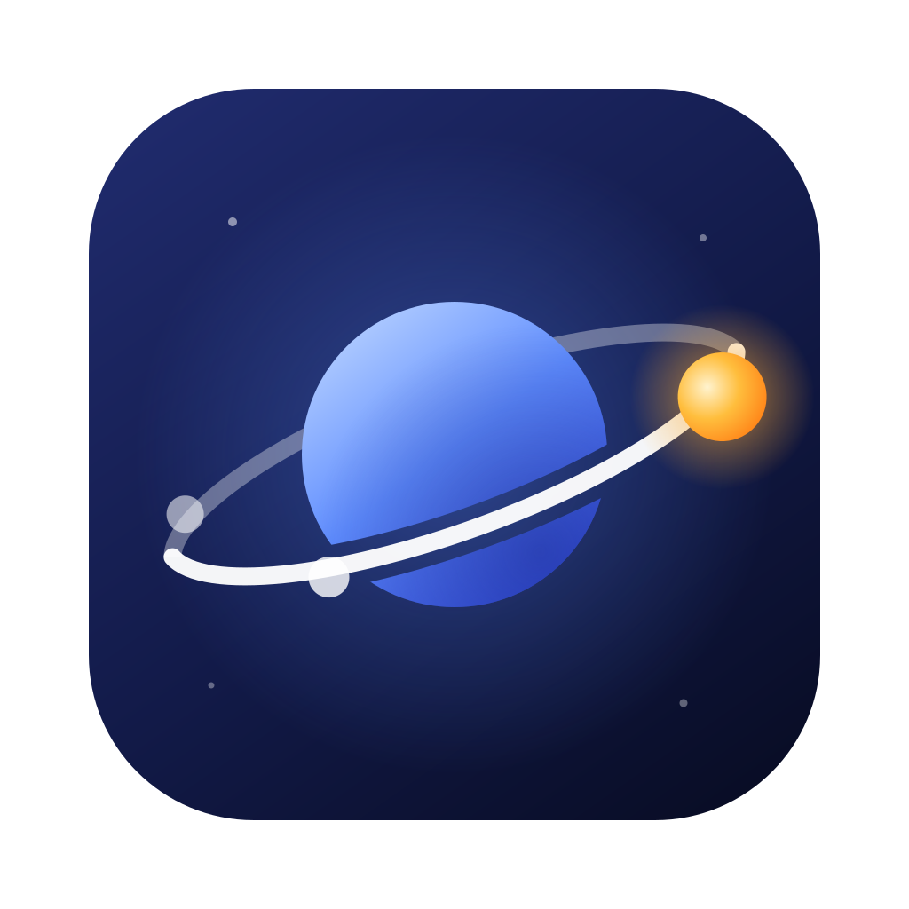
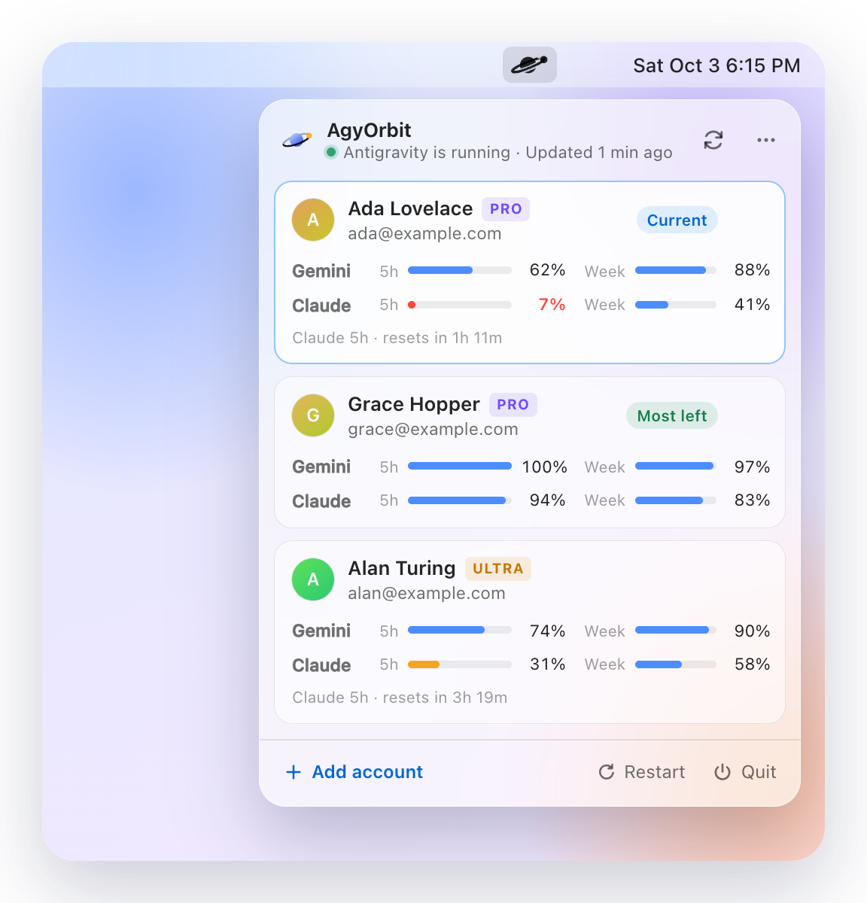
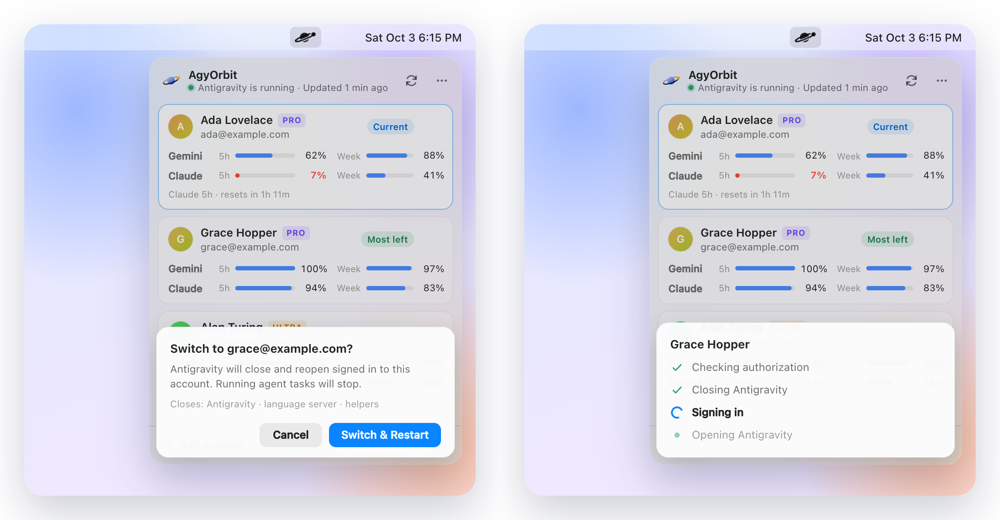

  

<h1 align="center">AgyOrbit</h1>

  Your Google Antigravity accounts, one click apart. 
  See every account's quota from the menu bar and switch without signing out.

  <strong>English</strong> | <a href="README.zh-CN.md">简体中文</a>

  
  
  

<a href="https://shengyy.github.io/agyorbit/"><strong>Website</strong></a> · <a href="https://github.com/shengyy/agyorbit/releases/latest"><strong>Download</strong></a>

  <picture>
    <source media="(prefers-color-scheme: dark)" srcset="assets/screenshots/hero-dark.png">
    
  </picture>

---

If you use more than one Google account with [Antigravity](https://antigravity.google), switching means
signing out, signing back in and waiting, and you never know which account still has Claude or Gemini
quota left. AgyOrbit lives in the menu bar (macOS) or the notification area (Windows) and fixes both.

## Features

- **Every account at a glance.** Gemini and Claude (Opus, Sonnet, GPT-OSS) quotas for each account, the
  5-hour and weekly windows side by side, with reset times. The account with the most quota left is
  marked.
- **Switch with one confirmed click.** AgyOrbit closes Antigravity and the `agy` CLI, signs Antigravity
  in to the chosen account, verifies it and reopens Antigravity. If anything fails, the previous sign-in
  is restored.
- **Add accounts in the browser.** A normal Google sign-in page; no need to sign out of Antigravity. The
  account Antigravity is already using is picked up automatically.
- **Restart or quit Antigravity** from the same place, with a confirmation that lists what will close.
- **Native feel.** A Liquid Glass popover on macOS, light and dark mode, English and Simplified Chinese.
- **Private.** Tokens stay in your system keychain and only ever go to Google. No server, no telemetry.

## Requirements

| Platform | Status |
|---|---|
| macOS 26 or later (Apple silicon and Intel) | Supported |
| Windows 10 / 11 x64 | Experimental: builds in CI, not yet verified on a real installation |

Antigravity must be installed. AgyOrbit reads its sign-in configuration from the local installation.

## Install

Download the latest `.dmg` (macOS) or `-setup.exe` (Windows) from
[Releases](https://github.com/shengyy/agyorbit/releases).

Builds are not code-signed yet. On macOS, open the app once with right-click → **Open**, or run
`xattr -dr com.apple.quarantine /Applications/AgyOrbit.app`. On Windows, choose **More info → Run
anyway** in SmartScreen.

To build from source, see [CONTRIBUTING.md](CONTRIBUTING.md).

## Use

1. Launch AgyOrbit and click its icon. The account Antigravity is signed in with appears as **Current**.
2. **Add account** opens Google sign-in in your browser. Pick another account and allow access.
3. Click an account (or its **Switch** button) and confirm. Antigravity restarts on that account.
4. Right-click an account to sign in again, copy its email or remove it. The `⋯` menu at the top has
   *Open at Login*, logs and Quit.

  <picture>
    <source media="(prefers-color-scheme: dark)" srcset="assets/screenshots/flow-dark.png">
    
  </picture>

## How it works

Antigravity keeps its sign-in in the system keychain (plus a fallback file). AgyOrbit signs accounts in
with Antigravity's own OAuth client, read from your local installation, so its tokens are exactly what
Antigravity itself would store. Switching rewrites that credential while Antigravity is closed.
Quotas come from the same Cloud Code endpoints the IDE uses. Details and the versions they were verified
on: [docs/antigravity-integration.md](docs/antigravity-integration.md).

## Privacy and fair use

AgyOrbit only switches which of **your own** accounts the official Antigravity app uses. It does not proxy
model traffic, share accounts or work around quotas, and it talks to nothing but Google. Please use it
within Google's terms. See [SECURITY.md](SECURITY.md) for exactly what is stored and sent.

AgyOrbit is an independent project and is not affiliated with or endorsed by Google. "Antigravity" and
"Gemini" are trademarks of Google LLC.

## Contributing

Issues and pull requests are welcome; Windows verification is the most useful help right now. Start with
[CONTRIBUTING.md](CONTRIBUTING.md) and [docs/](docs/README.md).

## License

[MIT](LICENSE)
